<!-- Please do not change this html logo with link -->

<a target="_blank" href="https://www.microchip.com/" id="top-of-page">
   <picture>
      <source media="(prefers-color-scheme: light)" srcset="images/mchp_logo_light.png" width="350">
      <source media="(prefers-color-scheme: dark)" srcset="images/mchp_logo_dark.png" width="350">
      
   </picture>
</a>

# Space Invaders 1D — CLB + SPI + WS2812 on PIC16F13145 with MCC Melody

A fully playable 1D Space Invaders game running on a 300-LED SK6812 RGBW strip, driven by the PIC16F13145 microcontroller using the Configurable Logic Block (CLB) and SPI peripherals. The CLB hardware-converts SPI data into the WS2812-compatible signal timing — no bit-banging required.

## Related Documentation

- [PIC16F13145 Product Page](https://www.microchip.com/en-us/product/PIC16F13145?utm_source=GitHub&utm_medium=TextLink&utm_campaign=MCU8_MMTCha_PIC16F13145&utm_content=pic16f13145-spi-ws2812-mplab-mcc&utm_bu=MCU08)
- [PIC16F13145 Code Examples on Discover](https://mplab-discover.microchip.com/v2?dsl=PIC16F13145)
- [PIC16F13145 Code Examples on GitHub](https://github.com/microchip-pic-avr-examples/?q=PIC16F13145)
- [SK6812 / WS2812 Data Sheet](https://cdn-shop.adafruit.com/datasheets/WS2812.pdf)

## Software Used

- [MPLAB® X IDE v6.30 or newer](https://www.microchip.com/en-us/tools-resources/develop/mplab-x-ide?utm_source=GitHub&utm_medium=TextLink&utm_campaign=MCU8_MMTCha_PIC16F13145&utm_content=pic16f13145-spi-ws2812-mplab-mcc&utm_bu=MCU08) or [MPLAB® Tools for VS Code®](https://www.microchip.com/en-us/tools-resources/develop/mplab-tools-vs-code?utm_source=GitHub&utm_medium=TextLink&utm_campaign=MCU8_MMTCha_PIC16F13145&utm_content=pic16f13145-spi-ws2812-mplab-mcc&utm_bu=MCU08)
- [MPLAB® XC8 v3.10 or newer](https://www.microchip.com/en-us/tools-resources/develop/mplab-xc-compilers?utm_source=GitHub&utm_medium=TextLink&utm_campaign=MCU8_MMTCha_PIC16F13145&utm_content=pic16f13145-spi-ws2812-mplab-mcc&utm_bu=MCU08)
- [PIC16F1xxxx_DFP v1.29.444 or newer](https://packs.download.microchip.com/)

**Important:** This project uses the CLB Synthesizer Library introduced in CLB v2.x. For migration details from older CLB configurations, refer to the [_Troubleshooting MCC Melody Configurable Logic Block (CLB) Projects Configured With CLB v1.x.x_](https://onlinedocs.microchip.com/oxy/GUID-9438FEC3-C80B-4328-8A8E-2531EDEE6155-en-US-1/index.html) migration guide.

## Hardware Used

- [PIC16F13145 VeryVerilog Development Board](https://github.com/MicrochipTech/veryVerilog) — primary target platform
  <br>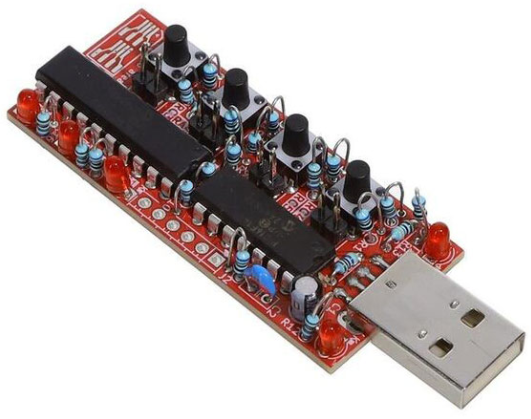

- SK6812 RGBW LED Strip (300 LEDs) — default configuration:
  <br>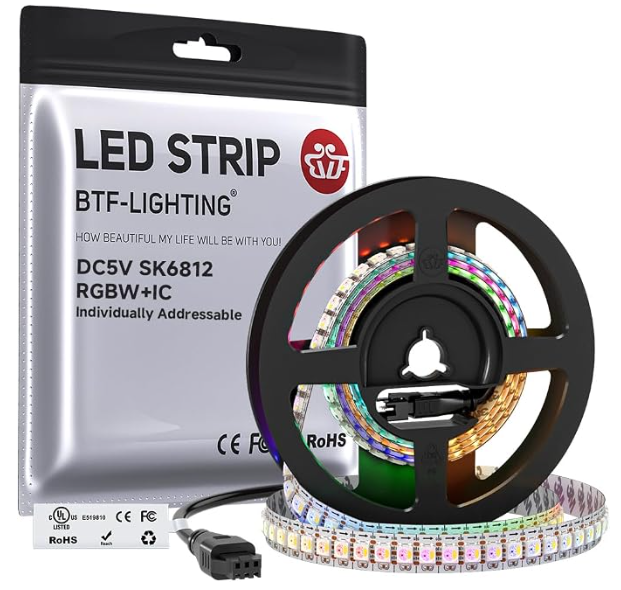

- **Alternatively:** any WS2812-compatible RGB strip (e.g. WS2812B, NeoPixel) — select `LED_TYPE_RGB` in `led.h` (see [Configuration](#configuration)).

> The project also runs on the [PIC16F13145 Curiosity Nano](https://www.microchip.com/en-us/development-tool/EV06M52A) with minor pin-mapping changes.

## Operation

To program the veryVerilog board, follow the steps in [How to Program the veryVerilog Board](#how-to-program-the-veryverilog-board).

---

## The Game

### Overview

Space Invaders 1D maps the classic arcade game onto a single row of 300 LEDs. The player stands at index 0 (one end of the strip) and a group of coloured invaders marches toward them from the far end. Fire coloured shots to destroy the invaders before they reach you.

<br>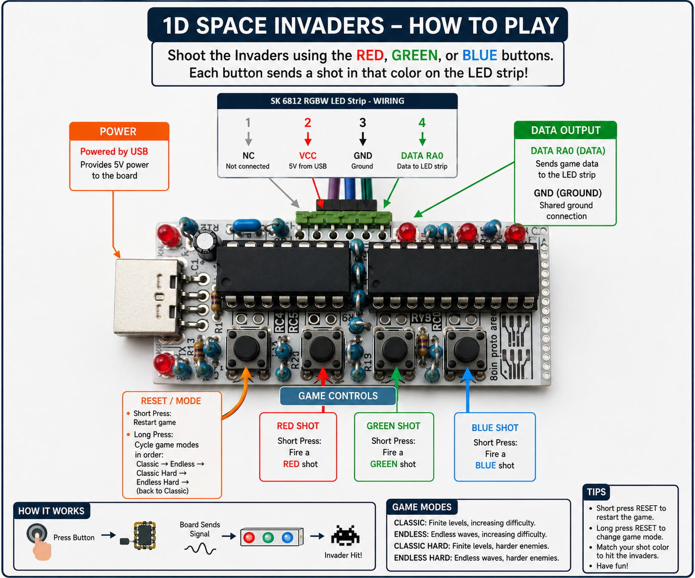

<br>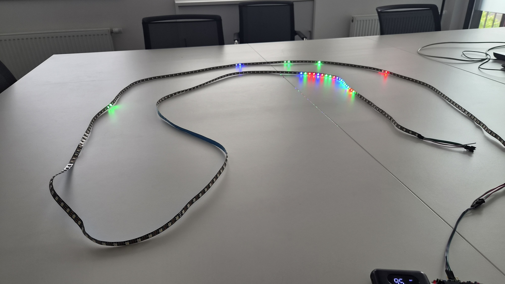
<br><video width="640" height="320" controls>
  <source src="images/demo.mp4" type="video/mp4">
</video>

**Note:** LED brightness is capped at ~35% of maximum to stay within USB power limits.

### Controls

| Button | Action |
|--------|--------|
| **PB1** short press | Start game / confirm mode |
| **PB1** long press  | In IDLE: cycle game mode. In-game: abort and return to IDLE |
| **PB2** | Fire **Red** shot |
| **PB3** | Fire **Green** shot |
| **PB4** | Fire **Blue** shot |

The three on-board LEDs (LED3/LED4/LED5) light up while the corresponding shot button is held, giving visual feedback on which colour is selected.

### Game Modes

Long-pressing PB1 in the IDLE state cycles through four modes. The IDLE blink on LED 0 indicates the current mode:

| Mode | Idle blink | Invader colours | Win condition |
|------|-----------|-----------------|---------------|
| **Classic** | Slow white | Red, Green, Blue | Destroy all 20 invaders |
| **Endless** | Fast white | Red, Green, Blue | Survive as long as possible |
| **Classic Hard** | Slow red | R, G, B + Cyan, Magenta, Yellow, White | Destroy all invaders |
| **Endless Hard** | Fast red | R, G, B + Cyan, Magenta, Yellow, White | Survive as long as possible |

### How to Destroy Invaders

**Easy modes (Classic / Endless):** Each invader is a single colour — shoot it with the matching colour shot to destroy it.

**Hard modes (Classic Hard / Endless Hard):** Multi-colour invaders require multiple hits:

| Invader colour | Required shots | Hits needed |
|----------------|---------------|-------------|
| Red / Green / Blue | Matching single colour | 1 |
| **Cyan** | Green + Blue (any order) | 2 |
| **Magenta** | Red + Blue (any order) | 2 |
| **Yellow** | Red + Green (any order) | 2 |
| **White** | Red + Green + Blue (any order) | 3 |

After each hit the invader's display colour updates to show which shots are still needed. For example, a White invader hit with Red turns Cyan (Green + Blue still required).

### Scoring and Difficulty

- Invaders advance toward the player at a regular tick rate that increases over time.
- Each miss — a shot that overshoots or hits a wrong-colour invader — adds a new invader at the far end of the strip (if space is available) **and** speeds up the invader group immediately.
- In Endless mode a new invader is added at the tail on every advance tick regardless of misses.

### Game States

```
IDLE ──(short press PB1)──► PLAYING
IDLE ──(long  press PB1)──► IDLE  (cycle mode)

PLAYING ──(all invaders gone, Classic modes)──► WIN
PLAYING ──(invader reaches index 0)────────────► GAME OVER
PLAYING ──(long  press PB1)────────────────────► IDLE  (abort)

WIN      ──(rainbow animation ends)──► IDLE
GAME OVER──(red blink ends)──────────► IDLE
```

---

## Concept

The CLB peripheral hardware-converts the MSSP1 SPI bitstream into WS2812-compatible pulse widths, eliminating the need for precise bit-banging in software. The figure below shows the implemented CLB circuit.

<br>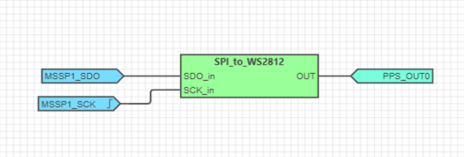

The Serial Data Out (SDO) and Serial Clock (SCK) signals are inputs to the `SPI_to_WS2812` block. The `SPI_to_WS2812` circuit (shown below) generates the correct WS2812 timing from the SPI stream using a D Latch, a 3-bit counter, and a 4-bit LUT with output value `0x7E0E`.

<br>

The "0 code" is three high cycles + five low cycles; the "1 code" is six high cycles + two low cycles — matching the SK6812 data sheet timing (approximately 1.25 µs per period at 800 kHz).

<br>

The 3-bit counter counts up to eight values per transmitted byte, reset by inverted SPI clock pulses. A 3-AND gate keeps the counter in reset until a new enable pulse arrives.

<br>

Logic analyser captures with `CLBSWIN0 = 0` (raw SPI) and `CLBSWIN0 = 1` (converted WS2812):

<br>
<br>

---

## Setup

The following peripheral and clock configurations are set in MCC Melody for the PIC16F13145:

1. **Configuration Bits:**
   - CONFIG1: External Oscillator disabled; Power-up default HFINTOSC (1 MHz)
     <br>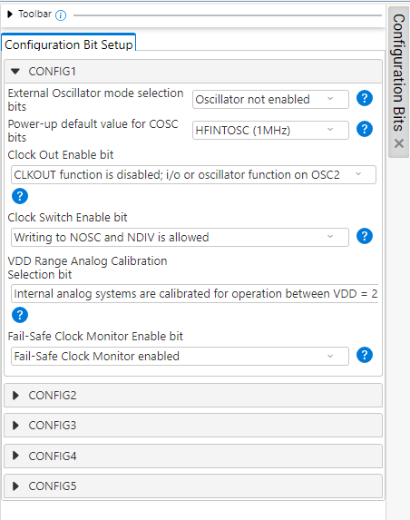
   - CONFIG2: Brown-out reset disabled
     <br>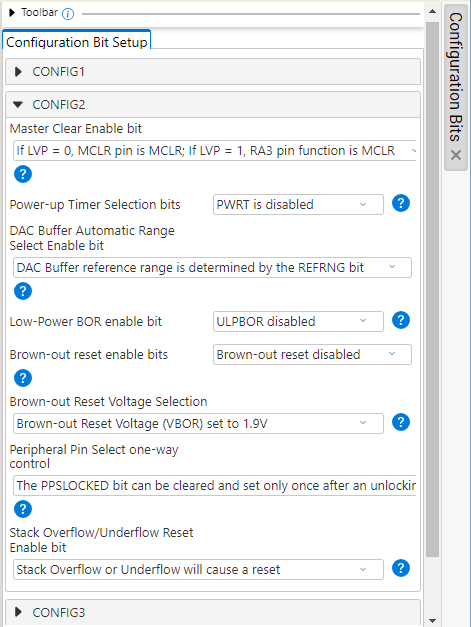
   - CONFIG3: WDT disabled
     <br>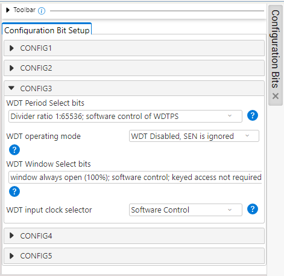

2. **Clock Control:**
   - Clock Source: HFINTOSC at 32 MHz, divider 1
     <br>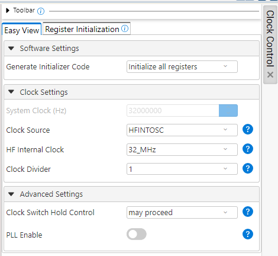

3. **CLB Synthesizer Library:**
   - CLB enabled; Clock: HFINTOSC ÷ 4
     <br>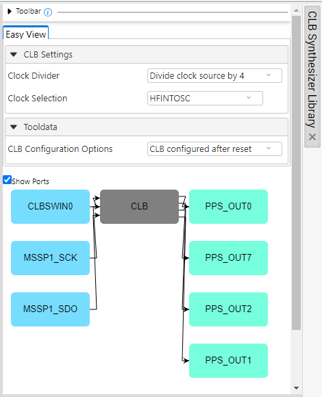

4. **MSSP1 (SPI):**
   - Mode: Host, SPI Mode 1, clock FOSC/4 with SSPxADD, **800 kHz**
     <br>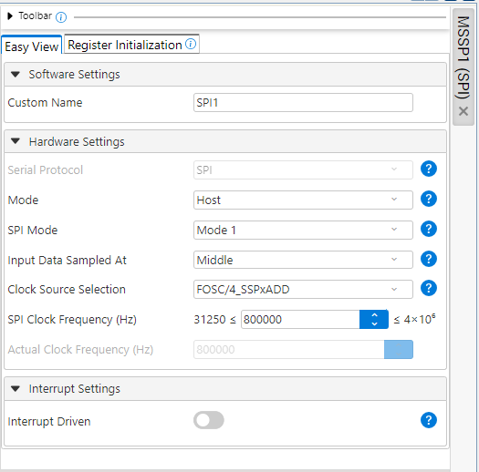

5. **CRC:** Auto-configured by CLB.

6. **Pin Grid View:**
   - CLBPPSOUT0 → RA0 (SPI_to_WS2812 output to LED strip)
     <br>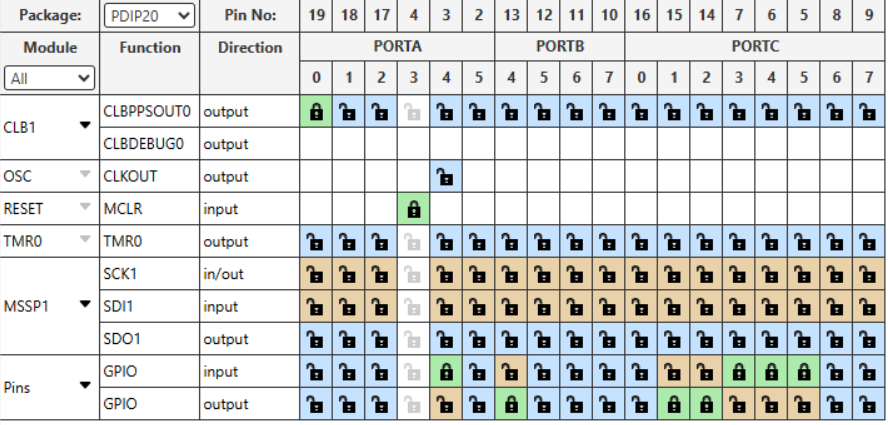

---

## Configuration

All user-configurable parameters are defined at the top of `pic16f13145_spi_to_ws2812_mcc.X/led.h`.

### LED Strip Type

Two LED strip types are supported. Exactly one of the following macros must be defined (comment out the other):

```c
#define LED_TYPE_RGBW   /* SK6812 RGBW — 4 bytes per LED: G R B W  (default) */
/* #define LED_TYPE_RGB */  /* WS2812 / NeoPixel RGB — 3 bytes per LED: G R B  */
```

| Define | Strip type | Bytes per LED |
|--------|-----------|---------------|
| `LED_TYPE_RGBW` (default) | SK6812 RGBW | 4 (G, R, B, W) |
| `LED_TYPE_RGB` | WS2812 / NeoPixel RGB | 3 (G, R, B) |

### Number of LEDs

```c
#define NUM_LEDS  300u
```

Change this value to match the actual length of your strip. The game board maps one-to-one onto the LED count, so shorter strips will result in a shorter playing field.

### LED Brightness

> **Note:** LED brightness is capped at ~35% of maximum to stay within USB power limits. To change this, adjust the `BRIGHT()` macro in `led.h`.

---

## Summary

This project demonstrates the PIC16F13145 CLB peripheral converting SPI data into WS2812-compatible timing entirely in hardware, freeing the CPU to run a complete 1D Space Invaders game with four game modes, multi-hit invaders, difficulty scaling, and win/lose animations — all on a 300-LED strip.

---

## How to Program the veryVerilog Board

1. Connect the veryVerilog board to your PC via USB.

2. Open the `pic16f13145_spi_to_ws2812_mcc.X` project in MPLAB X IDE.

3. Set the project as the main project:
   Right-click it in the **Projects** tab → **Set as Main Project**.
   <br>

4. Clean and build:
   Right-click the project → **Clean and Build**.
   <br>

5. Locate the generated `.hex` file in the `dist/` folder, then drag and drop it onto the veryVerilog web programmer at:
   **[https://microchiptech.github.io/veryVerilog/](https://microchiptech.github.io/veryVerilog/)**
   <br>

---

## Menu

- [Back to Top](#space-invaders-1d--clb--spi--ws2812-on-pic16f13145-with-mcc-melody)
- [Back to Related Documentation](#related-documentation)
- [Back to Software Used](#software-used)
- [Back to Hardware Used](#hardware-used)
- [Back to The Game](#the-game)
- [Back to Concept](#concept)
- [Back to Setup](#setup)
- [Back to Configuration](#configuration)
- [Back to Summary](#summary)
- [Back to How to Program the veryVerilog Board](#how-to-program-the-veryverilog-board)
